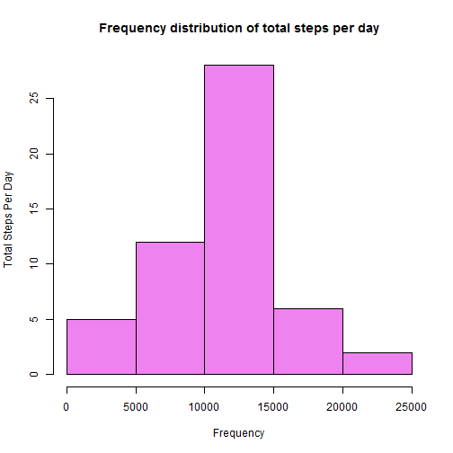
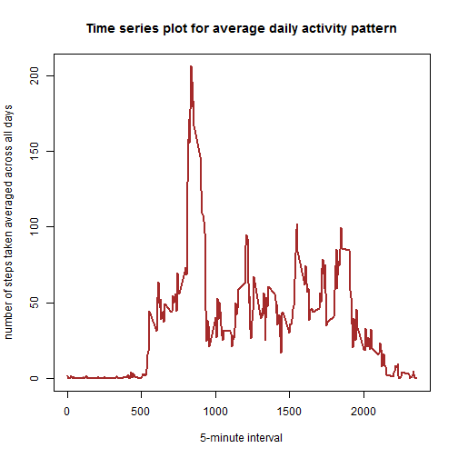
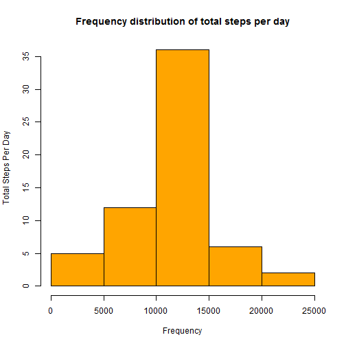
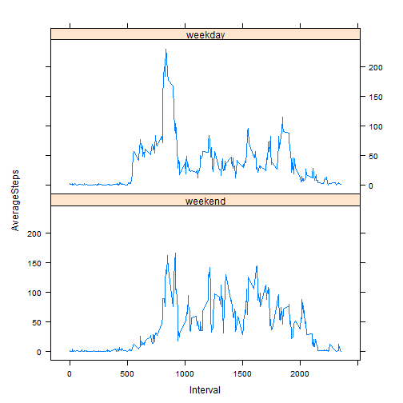

Loading and Pre-Processing Data
----------------------------------------------

1. Load the data (i.e. read.csv())

```r
# set the working directory 
setwd("~/Data/Venkata/Personal/Coursera/reproducible_research/Working_Directory")

# read the downloaded csv file from the data directory 
activity.df <- read.csv("Data//activity.csv") ## requires Data directory to be 
##present in working 
```

2. PreProcessing of the Data

```r
   #convert the variable date to Date type
   activity.df$date <- as.Date(activity.df$date , format = "%Y-%m-%d")

   # aggregate the activity data for each day 
   activity.day.df  <- aggregate(activity.df$steps, 
                         by        = list(activity.df$date),
                         FUN       = "sum",
                         na.rm     = TRUE)

   #change the names of the columns of the data frame for plotting ease
   names(activity.day.df) <- c("Date", "TotalStepsPerDay")

   # average number of steps for all days per each interval using aggregate
   # function
   activity.interval.df <- aggregate(activity.df$steps, 
                         by        = list(activity.df$interval),
                         FUN       = "mean",
                         na.rm     = TRUE)
   names(activity.interval.df) <- c("interval", "AverageSteps" )
```


What is the mean total number of steps per day ?
-----------------------------------------
1.  Histogram of the total number of steps taken each day

```r
   ## Generating histogram using base plot system
     with(activity.day.df, 
     hist(activity.day.df$TotalStepsPerDay,
          xlab = "Frequency", 
          ylab = "Total Steps Per Day",
          col = "violet",
          main = "Frequency distribution of total steps per day"))
```

 

2. The mean and median total number of steps taken per day

```r
   # mean of the total number of steps taken per day
   mean(activity.day.df$TotalStepsPerDay, na.rm = TRUE)
```

```
## [1] 9354
```

```r
   # median of the total number of steps taken per day
   median(activity.day.df$TotalStepsPerDay, na.rm = TRUE)
```

```
## [1] 10395
```
What is the average daily activity pattern?
--------------------------------------------
1. Time series plot (i.e. type = "l") 

```r
     ## using base plot with type = l 
     plot(activity.interval.df$interval, 
          activity.interval.df$AverageSteps,
          type = "l",
          xlab = "5-minute interval",
          ylab = "number of steps taken averaged across all days",
          main =  "Time series plot for average daily activity pattern",
          col  =  "brown",
          lwd  = 2)
```

 

2. Which 5-minute interval, on average across all the days in the dataset, 
contains the maximum number  of steps?

```r
   # interval value from the data frame for which avg steps are highest
   print(paste("5 minute interval that highest number of steps" ,
               activity.interval.df[which.max(activity.interval.df$AverageSteps),
                                    ]$interval,sep =" -- "))
```

```
## [1] "5 minute interval that highest number of steps -- 835"
```

Imputing missing values
------------------------------------------------
1. Calculate and report the total number of missing values 
in the dataset (i.e. the total number of rows with NAs)

```r
     # total number of  missing NA's 
    print(paste("The number of missing values in the activity dataset are ",
                sum(is.na(activity.df)), sep=" -- "))
```

```
## [1] "The number of missing values in the activity dataset are  -- 2304"
```
2. The strategy used to replace NA's is as follows 
 +   We have calculated the average steps for each interval across all days and
     stored that data in activity.interval.df.
 +   We will use the activity.interval.df to replace the NA's for steps in 
     the activity.df which is the original data frame , by making sure the steps 
     which are NA's are replaced by step values from activity.interval.df for the
     same interval value.
 +   This strategy will allow the NA's to be replaced by step values averaged 
     across all days.
 
3. Create a new dataset that is equal to the original dataset but with the  
 missing data filled in. 


```r
   # Copy the dataset into a new one for handling NA's
   activity.new.df <- activity.df
   ## iterate over the rows of the activity.new.df
   for(i in 1:nrow(activity.new.df)){
           if(is.na(activity.new.df[i,]$steps)){ ## get the steps which are NA's 
                 #for the steps which are NA's finding out the row which matches
                 #the interval value in the activity interval data frame
                 row.num <- which(activity.interval.df$interval ==
                                          activity.new.df[i,]$interval)
                 # replace the steps value in the data frame with that from 
                 #activity interval
                 # matches the row num 
                 activity.new.df[i,]$steps <-
                         activity.interval.df[row.num,]$AverageSteps
                 }
           }
```
4. Make a histogram of the total number of steps taken each day and Calculate
and report the mean and median total number of steps taken per day. Do these 
values differ from the estimates from the first part of the assignment? 
What is the impact of imputing missing data on the estimates of the total
daily number of steps?


```r
   # aggregate the activity data for each day 
   activity.new.day.df  <- aggregate(activity.new.df$steps, 
                         by        = list(activity.new.df$date),
                         FUN       = "sum",
                         na.rm     = TRUE,
                         na.action = NULL)
  #change the names of the columns of the data frame for plotting ease
  names(activity.new.day.df) <- c("Date", "TotalStepsPerDay")


   #Generating histogram using base plot system
     with(activity.new.day.df, 
     hist(activity.new.day.df$TotalStepsPerDay,
          xlab = "Frequency", 
          ylab = "Total Steps Per Day",
          col = "orange",
          main = "Frequency distribution of total steps per day"))
```

 
+ The mean and median total number of steps taken per day

```r
   # mean of the total number of steps taken per day
   mean(activity.new.day.df$TotalStepsPerDay, na.rm = TRUE)
```

```
## [1] 10766
```

```r
   # median of the total number of steps taken per day
   median(activity.new.day.df$TotalStepsPerDay, na.rm = TRUE)
```

```
## [1] 10766
```
The values of the mean and median differ from the previous values. The values of
have shifted since we replaced the NA's with average step values.

Are there differences in activity patterns between weekdays and weekends?
--------------------------------
1. Create a new factor variable in the dataset with two levels - "weekday" and   
   "weekend" indicating whether a given date is a weekday or weekend day.

Creating the factor variable in the dataset


```r
    #creating a new variable called weekday in the activity.new.df dataset
    #using lubridate package 
    if (require(lubridate)){
            #convert the variable date to Date type
            as.Date(activity.new.df$date , format = "%Y-%m-%d") 
            
            #use the wday function to get the weekday from the date
            activity.new.df$weekday <- wday(activity.new.df$date)
            
            # find the rows which have weekend dates
            weekends <- which(activity.new.df$weekday == 7 |
                                      activity.new.df$weekday == 1)
            #assign the value "weekend"" for all the above rows
            activity.new.df[weekends,]$weekday <- "weekend"

            #find the rows which have weekday dates
            weekdays <- which(activity.new.df$weekday > 1 & 
                                      activity.new.df$weekday < 7)
            #assign the weekday values for all the above rows
            activity.new.df[weekdays,]$weekday <- "weekday"
            
            #create the factors based on whether a day is weekend or weekday
            activity.new.df$weekday <- factor(activity.new.df$weekday,
                                              levels = c("weekend","weekday"))            
    }
```
2.Make a panel plot containing a time series plot (i.e. type = "l")  
  of the 5-minute interval (x-axis) and the average number of steps taken,  
  averaged across all weekday days or weekend days (y-axis).


```r
        # aggregate function is used to calculate avg across all weekdays for
        # 5 minute interval
        activity.new.interval.df <-aggregate(activity.new.df$steps, 
                                             by = list(activity.new.df$interval,
                                             activity.new.df$weekday),
                                             FUN   = "mean",
                                             na.rm = TRUE)
       names(activity.new.interval.df) <- c("Interval",
                                            "Weekday",
                                            "AverageSteps")
        
       #plotting system used is lattice
       library(lattice) 
    
        xyplot(AverageSteps ~ Interval | factor(Weekday) ,    
              data = activity.new.interval.df,
              type="l",
              aspect = 1/2)           
```

 


